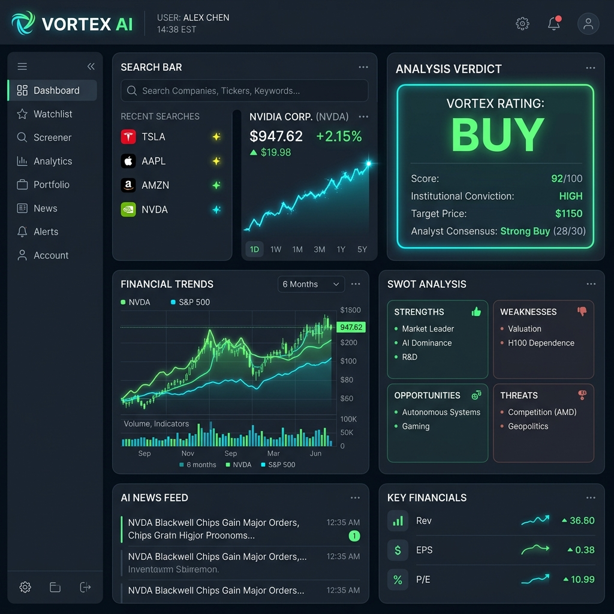
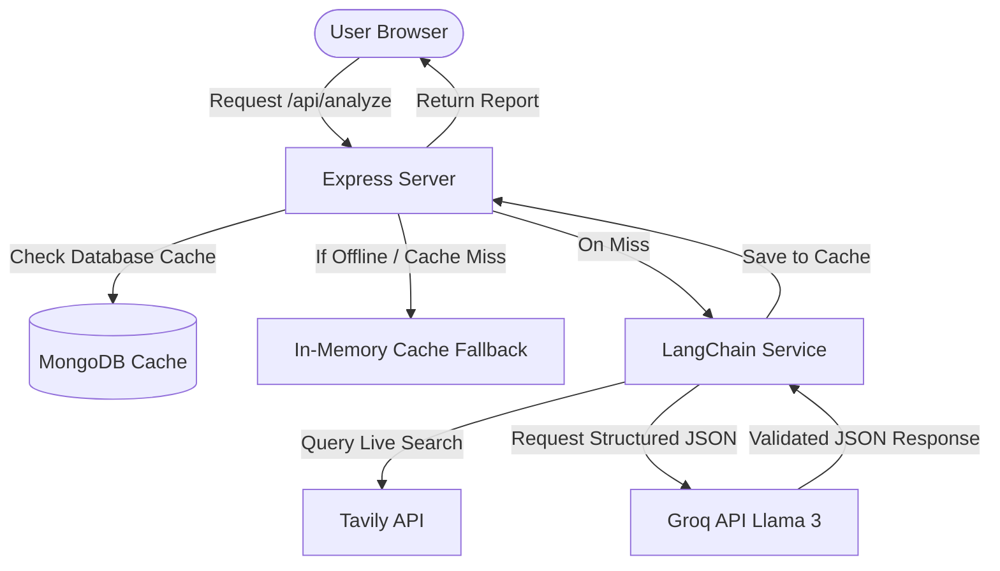

# Vortex AI — AI Investment Research Terminal

Vortex AI is a full-stack, professional-grade investment research platform. It acts as an automated financial analyst: users can enter any company name, and the application instantly conducts deep financial research, aggregates real-time market sentiment, performs competitor comparisons, and outputs a structured investment report with a clear **Buy, Hold, or Pass** verdict.



---

## 📋 Table of Contents
1. [Overview](#-overview)
2. [Key Implemented Features](#-key-implemented-features)
3. [How to Run It](#-how-to-run-it)
4. [How It Works (Architecture & Data Flow)](#-how-it-works-architecture--data-flow)
5. [Key Decisions & Technical Trade-offs](#-key-decisions--technical-trade-offs)
6. [Example Runs](#-example-runs)
7. [Future Roadmap](#-future-roadmap)

---

## 🔍 Overview

Vortex AI solves a common problem in financial research: the time-consuming process of scanning multiple financial databases, checking news sentiment, and drafting analysis reports. 

By utilizing advanced Large Language Models (LLMs), live Web search crawlers, and strict schema validation, the application synthesizes Wall Street-grade research reports in less than 3 seconds. It provides:
- **Financial Ratios & Trends:** Key metrics (PE, Operating Margin, ROE) and charts (12-month stock price and multi-year revenue/profits).
- **SWOT & Risk Assessment:** Automated SWOT grid and custom risk scoring.
- **Sentiment & Analyst Consensus:** Aggregated news sentiment percentage and Wall Street analyst targets.
- **Competitor Analysis:** Comparison table showing how the company performs against its top 4 peers.
- **Investment Thesis:** A detailed markdown-rendered report explaining the rationale behind the verdict.

---

## 🚀 Key Implemented Features

- **Real-Time Data Integration:** Integrates the **Tavily Search API** to fetch the most current financial reports, news articles, and corporate changes (updated for mid-2026).
- **Brand SVG Logo Pills:** Visual indicators for popular companies and search chips displaying custom, responsive inline SVG logos (Apple, Google, Microsoft, NVIDIA, Amazon, etc.).
- **High-Fidelity Caching Fallbacks:** Built-in MongoDB report cache with an automatic in-memory cache fallback mechanism if the database is offline.
- **API Failure Resilience:** The LLM prompt fallback parses pre-trained financial schemas to calculate plausible ratios and metrics if external APIs return null or limit keys, preventing `0` values from corrupting cards.
- **Interactive UI Transitions:** Smooth slide-ups and layout animations using **Framer Motion**, and responsive donut/line charts powered by **Recharts**.
- **Data Freshness Indicators:** Includes a dynamic metadata badge in the dashboard header indicating exactly when the report was compiled.

---

## 💻 How to Run It

### Prerequisites
- [Node.js](https://nodejs.org/) (v18 or higher recommended)
- [MongoDB](https://www.mongodb.com/) (running locally or a MongoDB Atlas URI)
- A [Groq API Key](https://console.groq.com/) (free to create)
- A [Tavily API Key](https://tavily.com/) (for real-time web search integration)

### Project Structure
```
├── backend/            # Express.js REST API
├── frontend/           # React 19 / TanStack Start UI
└── README.md
```

### 1. Backend Setup
1. Navigate to the backend directory:
   ```bash
   cd backend
   ```
2. Install dependencies:
   ```bash
   npm install
   ```
3. Configure the environment variables:
   - Create a `.env` file from the example:
     ```bash
     cp .env.example .env
     ```
   - Open `.env` and fill in your variables:
     ```env
     PORT=5000
     MONGO_URI=mongodb://localhost:27017/vortex-ai
     GROQ_API_KEY=your_groq_api_key_here
     TAVILY_API_KEY=your_tavily_api_key_here

     # Email Configurations (Optional - SMTP Welcome Emails)
     EMAIL_HOST=smtp.gmail.com
     EMAIL_PORT=587
     EMAIL_USER=your_email@gmail.com
     EMAIL_PASS=your_google_app_password
     ```
4. Start the backend in development mode:
   ```bash
   npm run dev
   ```
   The backend will start on `http://localhost:5000`.

### 2. Frontend Setup
1. Open a new terminal and navigate to the frontend directory:
   ```bash
   cd frontend
   ```
2. Install dependencies:
   ```bash
   npm install
   ```
3. Start the Vite development server:
   ```bash
   npm run dev
   ```
   The frontend will start on `http://localhost:3000` (or `http://localhost:5173`). Open this address in your browser.

---

## ⚙️ How It Works (Architecture & Data Flow)

### High-Level Architecture
Vortex AI utilizes a decoupled client-server architecture with a fast caching layer and strict data parsing.



### Key Data Flows
1. **User Action:** The user enters a company name (e.g., "NVIDIA") on the home screen.
2. **Routing:** The application redirects to `/report?company=NVIDIA`. The route validates parameters using **Zod**.
3. **API Request:** The client calls `/api/analyze` on the backend.
4. **Caching Layer Check:** The backend checks **MongoDB** to see if a report for NVIDIA already exists (with a 7-day TTL). If MongoDB is offline, it transparently checks the **In-Memory Cache**.
5. **AI Synthesis (on Cache Miss):** The backend formats a dynamic prompt and invokes **LangChain** tied to `ChatGroq`. It binds a Zod schema (`CompanyReportSchema`) using `withStructuredOutput()` to force the LLM to output a strict, validated JSON payload.
6. **Data Presentation:** The frontend receives the formatted JSON, handles transitions via **Framer Motion**, and plots performance data dynamically using **Recharts**.

---

## ⚖️ Key Decisions & Technical Trade-offs

### 1. React 19 + TanStack Start vs. Next.js
* **Decision:** We chose a React 19 single-page app architecture built on **TanStack Start & Router** rather than standard Next.js.
* **Trade-off:** Next.js has a larger ecosystem, but TanStack Router provides 100% type-safe routes, built-in query handling, and faster, cleaner client-side transitions. This keeps the frontend exceptionally responsive and lightweight while maintaining SSR compatibility.

### 2. Groq LLM Engine
* **Decision:** We selected **Groq (Llama-3 models)** as the core LLM provider.
* **Trade-off:** While OpenAI offers models with larger context windows, Groq's low-latency inference speeds (800+ tokens/sec) allow the terminal to compile report structures and return them in less than 3 seconds on a cache miss, providing a smooth user experience.

### 3. Dual-Layer Caching (MongoDB + Memory Fallback)
* **Decision:** We built a custom caching middleware that checks MongoDB first, but falls back to an in-memory `Map` if the database connection fails.
* **Trade-off:** Maintaining two caching structures adds slight code complexity, but it ensures the app is highly resilient and will function normally even if MongoDB services are temporarily disconnected.

### 4. Schema-Enforced Generation (`withStructuredOutput`)
* **Decision:** Instead of requesting raw text and parsing markdown on the frontend, the agent enforces structured JSON output using LangChain and Zod validation at the model level.
* **Trade-off:** This restricts the LLM from generating arbitrary text lengths, but it guarantees that the frontend will never crash due to a missing property or invalid JSON formatting from the AI.

---

## 📊 Example Runs

### Case 1: Apple Inc. (AAPL)
* **Verdict:** BUY (Confidence: 85%, Score: 78)
* **Analyst Consensus:** Strong Buy (Target: $240.00)
* **Thesis Excerpt:** *Apple's robust services revenue growth and premium pricing power offset short-term hardware cycles. Highly recommended for long-term compound growth portfolio.*

### Case 2: Tesla, Inc. (TSLA)
* **Verdict:** HOLD (Confidence: 70%, Score: 58)
* **Analyst Consensus:** Hold (Target: $195.00)
* **Thesis Excerpt:** *Tesla remains a market leader in EV infrastructure; however, valuation multiples remain elevated compared to legacy automakers. Wait for gross margin stabilization before entering.*

---

## 📈 Future Roadmap

1. **Multi-Agent RAG Search:** Implement a multi-agent system where a Search Agent retrieves current SEC filings, a Web Agent crawls financial news, and a Synthesis Agent compiles the final report.
2. **Interactive Chart Zooming:** Connect the Recharts indicators to a real-time price tick API for sub-minute trading charts.
3. **Advanced PDF Export:** Allow users to download styled PDF reports containing customized analysis graphs.
