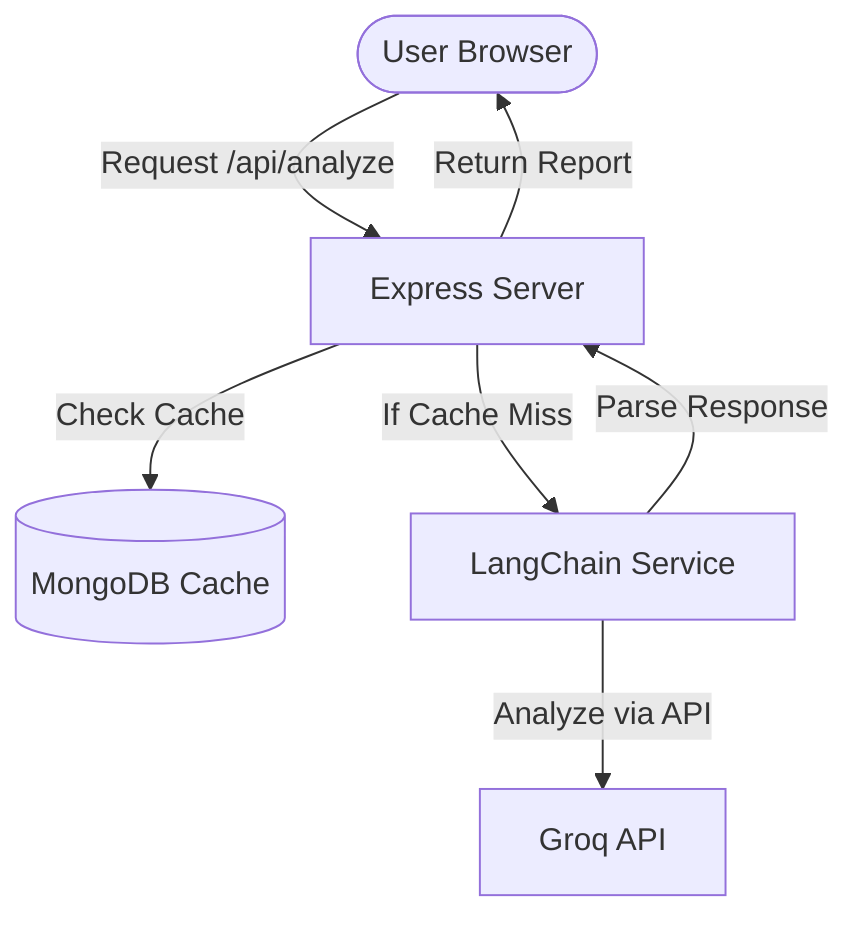

# Vortex AI - Investment Research Agent Project Deep Dive

This document provides a comprehensive technical overview of the Vortex AI application codebase. You can copy and paste this documentation directly to another LLM to explain the architecture, tech stack, file structure, and data flows.

---

## 1. Project Overview & Architecture
Vortex AI is a full-stack, institutional-grade AI investment research terminal that enables users to input a company name and receive a structured, real-time investment analysis.

### High-Level Architecture
- **Frontend**: A single-page application (SPA) built using **React 19**, **Vite**, **Tailwind CSS**, and **TanStack React Start** (supporting Server-Side Rendering (SSR) fallback wrapping and client hydration). State and routing are managed using **TanStack Router** and **TanStack Query**.
- **Backend**: A REST API built on **Node.js** and **Express**. It orchestrates API requests, manages a dual-layer cache (MongoDB + in-memory fallback), and interfaces with LLMs using **LangChain** and **Groq LLM**.
- **Database / Cache**: MongoDB is used to cache generated investment reports with a 7-day Time-To-Live (TTL). If MongoDB is offline, the backend transparently falls back to an in-memory caching system.



---

## 2. Tech Stack
### Backend
- **Node.js** (ES Modules: `"type": "module"`)
- **Express**: Router and endpoint handler.
- **Mongoose**: MongoDB object modeling and caching logic.
- **LangChain** (`@langchain/core`, `@langchain/groq`): Chains the prompt template and handles Groq LLM structured JSON response parsing.
- **Zod**: Input validation schemas (used in routes and LangChain parser).
- **Helmet & CORS & Morgan**: Security, cross-origin resource sharing, and request logging.

### Frontend
- **React 19**: Modern UI rendering.
- **Vite & Nitro**: Dev server, compiler, and asset bundler.
- **TanStack React Start & Router**: Full-featured routing system, layout loading, and server middleware error handling.
- **Tailwind CSS (v4)**: Modern, CSS-variables-first styling utility.
- **Framer Motion**: Premium animations (fade-ins, layout transitions).
- **Recharts**: Responsive visual charts (Revenue, Profit, Stock price trends).
- **Lucide React**: Vector icon library.
- **Sonner**: Toast notification banner.
- **Axios**: HTTP API client.

---

## 3. Directory and File Structure

### Backend Directory (`/backend`)
```
backend/
├── src/
│   ├── config/
│   │   └── db.js               # MongoDB connection setup
│   ├── controllers/
│   │   └── analyzeController.js# Caching logic, orchestrates LangChain report generation
│   ├── middleware/
│   │   ├── errorHandler.js     # Uncaught express exception handler
│   │   └── validate.js         # Express Zod request schema validator middleware
│   ├── models/
│   │   └── Report.js           # Mongoose report schema with TTL index & compound lookup indexes
│   ├── routes/
│   │   └── analyze.js          # REST routing setup for POST /api/analyze
│   ├── services/
│   │   └── langchainService.js # Prompts ChatGroq, configures structured output parser
│   └── server.js               # Entry point; configures express, middlewares, database connection
├── .env.example                # Example environment variables
├── package.json                # Dependencies and build/dev scripts
└── package-lock.json
```

### Frontend Directory (`/frontend`)
```
frontend/
├── src/
│   ├── components/
│   │   ├── investment/
│   │   │   ├── ErrorState.jsx  # Fallback view for failed API calls
│   │   │   ├── Footer.jsx      # Footer layout
│   │   │   ├── Hero.jsx        # Landing page search inputs, popular & recent search lists
│   │   │   ├── LoadingScreen.jsx# Step-by-step progress/loading timeline animation
│   │   │   ├── Navbar.jsx      # Sticky premium navbar with engine online indicator and settings modal trigger
│   │   │   ├── Results.jsx     # Master rendering page for charts, metrics, SWOT, analyst ratings, markdown thesis
│   │   │   └── SettingsModal.jsx# Modal configures custom API key, model, and temperature
│   │   └── ui/
│   │       ├── button.jsx      # Shadcn custom button component
│   │       ├── dialog.jsx      # Shadcn custom dialog/modal component
│   │       ├── input.jsx       # Shadcn custom input field component
│   │       ├── select.jsx      # Shadcn custom dropdown select component
│   │       └── slider.jsx      # Shadcn custom slider component
│   ├── hooks/                  # Custom react hooks
│   ├── lib/
│   │   ├── error-capture.js    # Uncaught SSR error listener utility
│   │   ├── error-page.js       # Fallback HTML page template for rendering catastrophic SSR errors
│   │   ├── error-reporting.js  # Logs errors to monitoring endpoints
│   │   └── utils.js            # Tailwind CSS classes merger (cn wrapper using clsx + tailwind-merge)
│   ├── routes/
│   │   ├── __root.jsx          # Route layout: configures og-tags, QueryClientProvider, and general error boundary
│   │   ├── index.jsx           # `/` landing page router view
│   │   └── report.jsx          # `/report` route that fetches and orchestrates loading/results/error states
│   ├── services/
│   │   └── api.js              # Axios request config, Axios interceptors, error normalization
│   ├── routeTree.gen.js        # TanStack Router auto-generated tree
│   ├── router.jsx              # Configures TanStack Router with QueryClient
│   ├── server.js               # TanStack Start SSR entry wrapper
│   ├── start.js                # TanStack Start server-side middleware error boundary
│   └── styles.css              # Main stylesheets importing Tailwind CSS variables and custom utilities
├── components.json             # Shadcn directory/alias mapping setup
├── eslint.config.js            # ESLint rules configuration
├── jsconfig.json               # Path aliases configuration (@/* -> src/*)
├── tsr.config.json             # TanStack Router configuration
├── vite.config.js              # Vite config; sets up proxy mapping /api to http://localhost:5000
├── .gitignore                  # Git untracked ignore file
├── .prettierignore             # Prettier format ignore list
├── .prettierrc                 # Prettier configuration rules
└── package.json                # Dependencies and dev/lint/format scripts
```

---

## 4. Key Data Flows

### A. The Analysis Request Flow
1. **Search Initiation**: The user types a company (e.g., "Apple") into the [Hero](file:///c:/Users/hp/Desktop/AIIIIIIIIIIIIIIIIIIIIIIIIIIIIIII/frontend/src/components/investment/Hero.jsx) search box on `/` and presses Enter.
2. **Redirection & Route Validation**: The router redirects to `/report?company=Apple`. The [report.jsx](file:///c:/Users/hp/Desktop/AIIIIIIIIIIIIIIIIIIIIIIIIIIIIIII/frontend/src/routes/report.jsx) route validates the query search parameters using Zod.
3. **API Invocation**: An API call is fired using `analyzeCompany("Apple")` defined in [api.js](file:///c:/Users/hp/Desktop/AIIIIIIIIIIIIIIIIIIIIIIIIIIIIIII/frontend/src/services/api.js). This checks local storage for a custom Groq API Key, Model, and Temperature setting to send in the request payload.
4. **Backend Cache Verification**: The backend [analyzeController.js](file:///c:/Users/hp/Desktop/AIIIIIIIIIIIIIIIIIIIIIIIIIIIIIII/backend/src/controllers/analyzeController.js) checks if a report already exists for `"apple"` with the specified model and temperature settings in **MongoDB** or **in-memory fallback cache**.
   - **Cache Hit**: Served instantly to the client.
   - **Cache Miss**: Continues to LLM generation.
5. **AI Report Generation**: [langchainService.js](file:///c:/Users/hp/Desktop/AIIIIIIIIIIIIIIIIIIIIIIIIIIIIIII/backend/src/services/langchainService.js) formats a prompt template containing Wall Street strategy guidelines, instantiates `ChatGroq`, passes a Zod schema (`CompanyReportSchema`) using `withStructuredOutput()` to enforce strict JSON output, and executes the chain.
6. **Persistence**: The generated JSON is saved to MongoDB (expires in 7 days) or the local memory cache and returned.
7. **Frontend Render**: The client receives the JSON report, hides the loading state, and displays the [Results](file:///c:/Users/hp/Desktop/AIIIIIIIIIIIIIIIIIIIIIIIIIIIIIII/frontend/src/components/investment/Results.jsx) page, populating interactive charts and markdown text.

---

## 5. Structured Data Schema (`CompanyReportSchema`)
The backend enforces a strict data shape from the LLM, containing the following properties:
- **`overview`**: name, ticker, sector, industry, marketCap, headquarters, founded, ceo, employees, website, summary, logo
- **`decision`**: verdict (BUY / HOLD / SELL), confidence (0-100), score (0-100)
- **`reasoning`**: array of steps detailing action steps performed (e.g., "Financial Analysis", "Sentiment Analysis")
- **`metrics`**: array of financial ratios (Revenue, Net Profit, EPS, P/E, ROE, Operating Margin) with change delta and indicator
- **`revenue`**: historical data array of (year, revenue in billions, profit in billions)
- **`stock`**: monthly price trend array of (month, price) for 12 months
- **`health`**: rating array of (label, score out of 100) for liquidity, debt, cash position, margins, etc.
- **`swot`**: strengths, weaknesses, opportunities, threats lists
- **`risk`**: risk score (0-100) and factors array (name, level)
- **`news`**: recent headlines, publisher source, time, summary, and sentiment
- **`sentiment`**: positive/neutral/negative percentage breakdown
- **`analyst`**: buy/hold/sell analyst recommendation count, consensus string, price target string
- **`competitors`**: metrics table (revenue, growth, marketcap, P/E, operating margin) for top 4 competitors
- **`pros` & `cons`**: list of buying reasons and warning factors
- **`thesis`**: detailed markdown block analyzing the company
- **`sources`**: sources and links citation array
